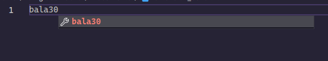
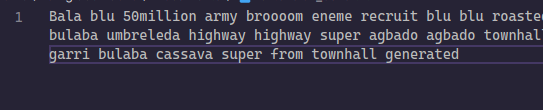

# VSC Bala Blu

A Visual Studio Code extension that adds dummy bala blu text in your editor.

To use the extension, open the command palette (<kbd>F1</kbd> or <kbd>cmd/ctrl+shift+p</kbd>, type "bala blu" and select to insert either a line or paragraph. Also by typing 'bala' or with a number specifying the number of words to be added, this extension will automatically add dummy bala blu text.

## Screenshots

The following commands are added:

- `bala-blu.line`
- `bala-blu.paragraph`
- `bala-blu.multipleParagraphs`

## Credits

- The core functionality is provided by the only dependency of this extension [lorem-ipsum npm package](https://www.npmjs.com/package/lorem-ipsum)
